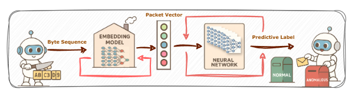

# Secure-Architecture-4-Drone

**Secure Architecture for Drone: Packet-level IDS and Lightweight Channel Encryption**

This repository contains several modules for exploring vulnerabilities in the MAVLink protocol, cryptographic efficiency, and intrusion detection at the packet level. 


Do not use the provided code in any real-world environment without proper authorization.

---

# Downloadata.py — Usage Guide

This script downloads datasets via URL link from the Google Drive folder

## Requirements
- Python 3.7+
- `gdown` (installed automatically if missing)

## Usage

### Download all contents into `./dataset`:
```bash
python Downloadata.py
```

### Download all contents into a custom directory:
```bash
python Downloadata.py -o ./data_all
```

### Download only specific files or folders:
```bash
python Downloadata.py -o ./data_subset --only CIC UNSW MAVLink attack_records.csv *.pcapng
```

---

## 📂 CRC
Code for validating the vulnerability of MAVLink’s CRC checksum mechanism and demonstrating how a greedy search algorithm can recover the `crc_extra` value.

- **./CRC/CRC_EXTRA.py**  
  Given a raw MAVLink packet, obtain the corresponding `crc_extra` value for its `msgid`.

- **./CRC/Verify.py**  
  Verify the vulnerability by checking CRC correctness using known `crc_extra` together with header and payload.

## 📂 Cipher
A lightweight proxy for benchmarking encryption/decryption algorithms by measuring latency and efficiency.

- **./Cipher/main.py**  
  Entry point for starting the proxy.

- **./Cipher/encrypt_utils.py**  
  Provides functions and definitions for each algorithm; serves as the interface between the main execution window and the actual encryption/decryption implementations.

- **./Cipher/...**  
  Remaining code implementing specific cipher algorithms.

## 📂 ECIDS
Framework for packet-level intrusion detection (IDS), with two classifier head implementations based on Word2Vec embeddings.



- **./ECIDS/word2vec_MLP.py**  
  ECIDS variant using MLP as the classifier head. Allows gradient-based feedback and has room for further improvements.

- **./ECIDS/word2vec_RF.py**  
  ECIDS variant using Random Forest as the classifier head. Achieves the best performance among lightweight classifier comparisons.

## 📂 Attack
Contains various UAV attack simulation codes.  
Details are not included here for security considerations.


---
